# Shared Contacts Admin (SCA)

### Manual on how to install SCA on GAE with google apps

### Originally published 17 April 2016
Updated 20 August 2016

Credit:
This tutorial is based off the work and slides originally created by
Edwin Vinas, 
ULAPPH Corporation

### Download installer zip file

From:
https://github.com/takbok/shared-contacts-admin
click the green "Clone or download" button followed by "Download ZIP".  Then Unzip the downloaded ZIP file.

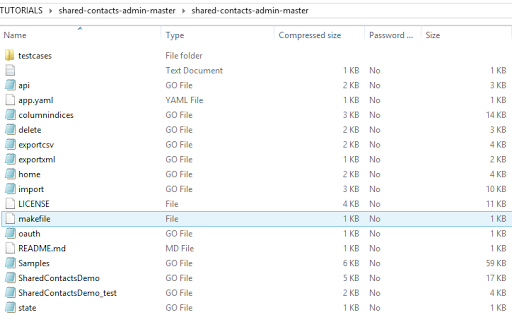

Unzip all files under "shared-contacts-admin-master" folder

### Take note of the file "oauth.go" which contains authentication details

* Note that the ClientID and ClientSecret can be configured on [https://console.cloud.google.com](https://console.cloud.google.com)

* Since there are multiple settings to be done in Developers Console and Google Apps, they will be covered separately

* For now, don't change anything yet on the oauth.go, we will try to compile & upload first to appengine

		var (
		    config = &oauth2.Config{
		        ClientID:     `?????????-??????????.apps.googleusercontent.com`,
		        ClientSecret: `?????????????`,
		        RedirectURL:  `ideally-should-be-set-later`,
		        Scopes:       []string{`http://www.google.com/m8/feeds/contacts/`},
		        Endpoint:     google.Endpoint,
		    }
		
		    yeah = "yeah"
		)### Create an appengine project on https://console.cloud.google.com

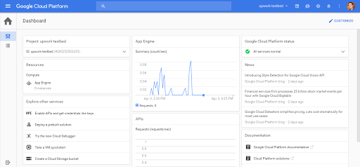

Take note of the email address and project ID

### Remove unneeded folders & download required golang packages

After un-zipping the ZIP delete the following three folders:

* tutorial
* video-tutorial
* vendor

See Issue # 9 for background on the reason for deleting the "vendor" folder.  https://github.com/takbok/shared-contacts-admin/issues/9

Because the "vendor" folder has been removed, some needed golang packages must now down be downloaded.  If using Microsoft Windows, run

* "install-packages.bat"

to install the required golang packages.

### Open a command prompt & upload app to appengine

appcfg.py --application=PROJ_ID --email=EMAIL@EMAIL.COM --no_cookies update shared-contacts-admin-master

### After successful upload, try the website URL

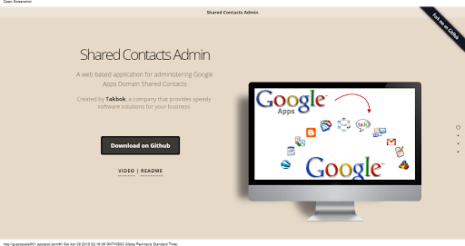

This is the one-page web interface of the SCA

### The Imports section

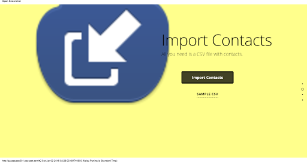

This is where you can Import Contacts

### The Exports Section

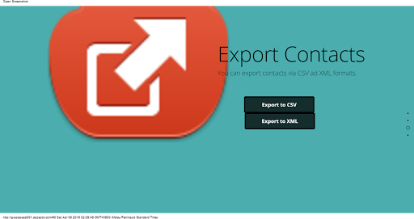

This is where you can Export Contacts

### The Delete Section

This is where you can Delete Contacts

### Now you have  working URL but it is not yet usable...

* As expected, there will be errors when you try the SCA as is...

* What needs to be done so we can make use of this app?

1) Setup Google Developer Console

2) Setup Google Apps for Work

## Setup Google Developer Console (Part 1)

### Enable Contacts API

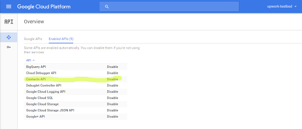

You must have the Contacts API enabled

### The API Credentials

Note that an entry was automatically added by Google Apps to enable sharing of contacts

### Looking at the "domain-wide delegation"

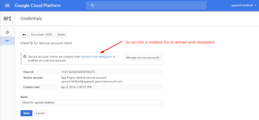

This will appear only after configuring Google Apps

### Redirect URIs

* http://g-apps-sca001.appspot.com/contacts/export

* http://g-apps-sca001.appspot.com/import/do

* http://g-apps-sca001.appspot.com/contacts/exportxml

* http://g-apps-sca001.appspot.com/contacts/delete

### Looking at the oAuth Keys

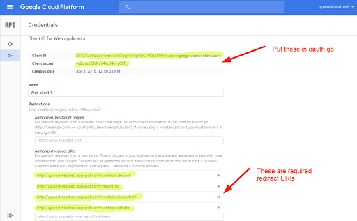

No need to download JSON, just update the oauth.go

### Update Consent screen

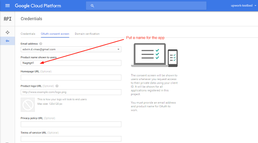

You can change it to SCA; Nagitgit is just a sample name

## Setup Google Apps

### Go to Google Apps http://apps.google.com as admin

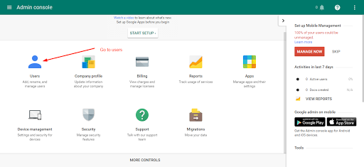

Go to Users to configure contacts sharing

### Click admin user

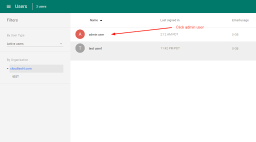

Go to admin user

### Click to show apps

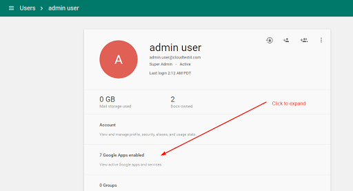

Go to apps list

### Click to configure contacts

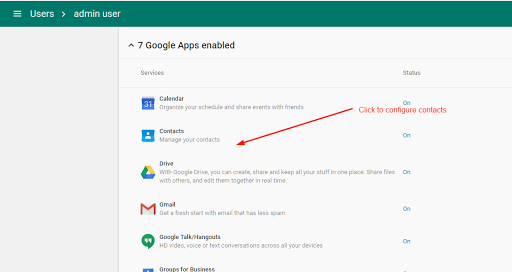

Go to contacts

### Click to go to advanced settings

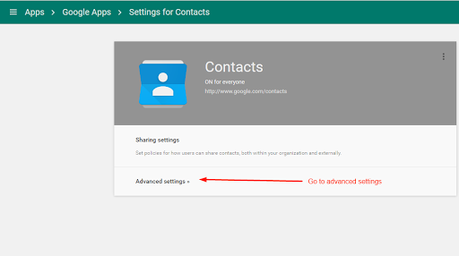

Go to advanced settings

### Enable options for Contacts Sharing

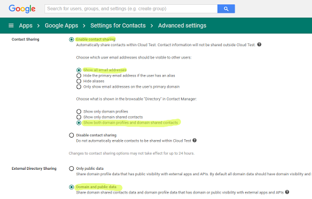

Enable contacts sharing

## Setup Google Developer Console (Part 2)

### Manage Service Accounts

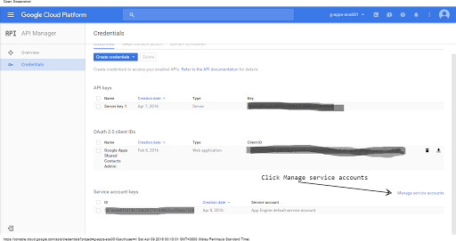

Click to manage service accounts

### Select App Engine service account

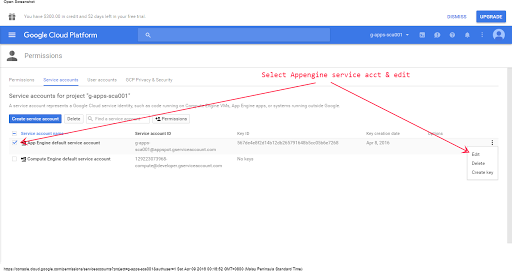

Click to Edit App Engine service account

### Enable Google Apps Domain-Wide Delegation

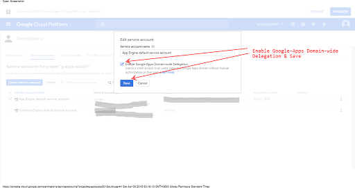

Enable the domain-wide delegation

### The Newly Added Service account client

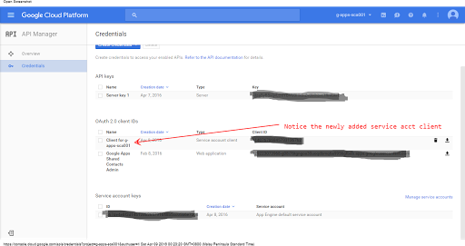

Notice that a new client has been created automatically for the service account

## APIs and Google Apps settings done!

### Now recompile Go project and upload to appengine

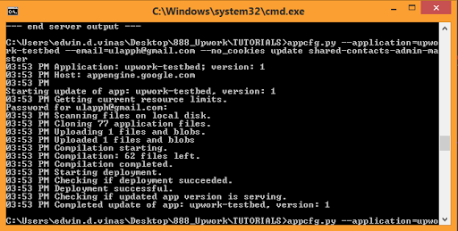

appcfg.py --application=PROJ_ID --email=EMAIL@EMAIL.COM --no_cookies update shared-contacts-admin-master

## Testing the SCA

## Importing contacts from CSV

### Go to the Imports section

Go to the Imports section and click Import Contacts

### Point to CSV file and Enter Google Apps Domain

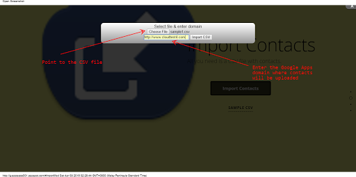

Point to CSV contacts file and Enter Google Apps Domain

### Results will show successful imports

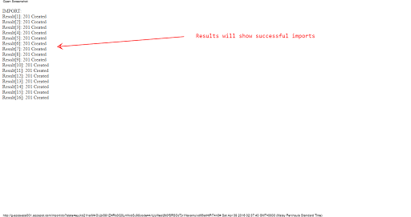

Number of records imported will be shown

## Exporting contacts to CSV

### Go to Exports Section

Go to Exports section and click Export CSV

### Enter Google Apps Domain

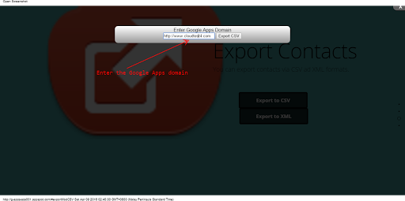

Enter Google Apps Domain

### CSV File will be downloaded

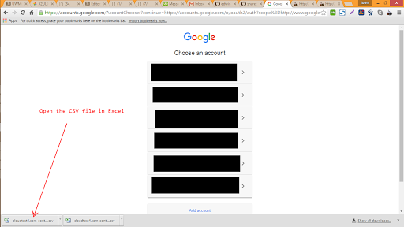

Double-click on the CSV download item

### Open the exported excel file

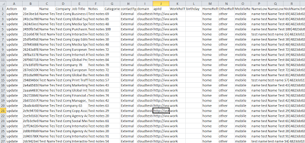

Contacts successfully exported to Excel

## Exporting contacts to XML

### Go to Exports Section

Go to Exports section and click Export CSV

### Enter Google Apps domain name

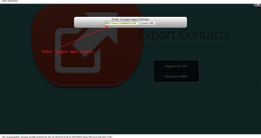

Enter Google Apps domain

### XML file will be downloaded

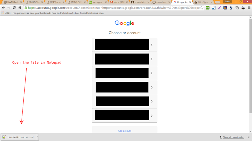

Double-click on the XML download item

### Open the exported XML file

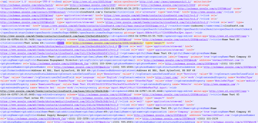

Contacts successfully exported to XML

## Viewing the Shared Contacts in contacts.google.com

### Visit Contacts https://contacts.google.com (as admin)

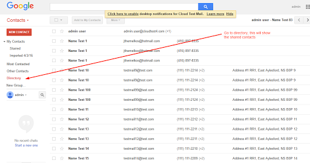

Contacts are now visible on the domain

### Visit Contacts https://contacts.google.com (as ordinary user)

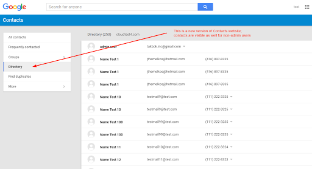

Contacts are now visible on the domain

## Deleting Contacts

### Go to the Delete Contacts section

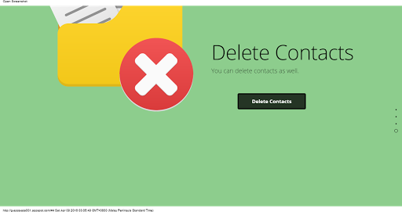

Go to Delete Contacts section

### Enter Google Apps domain

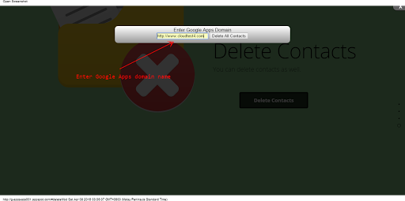

Enter the Google Apps domain

### Results will show batch delete request

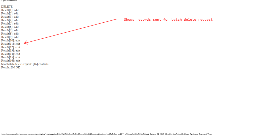

Records were sent for batch delete request
